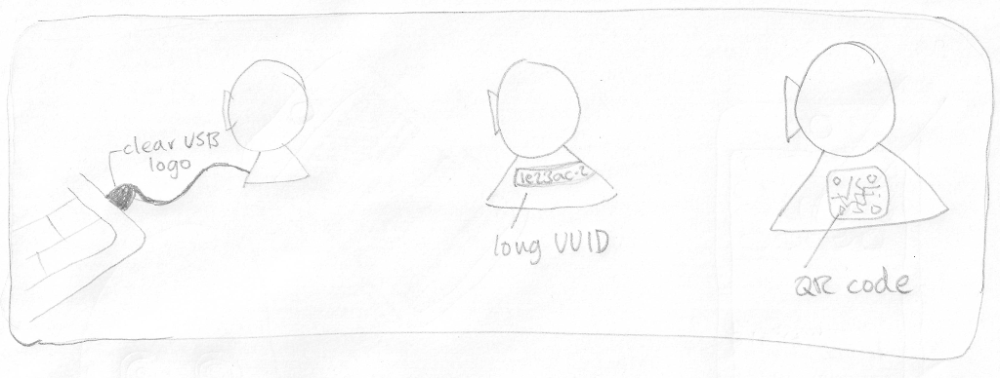
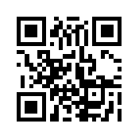

3 alternatives
--------------

This picture shows the same baby monitor three times.

The text above ("clear USB logo" etc.) should _not_ be included in the cartoon.

**1.**

The first time the baby monitor is connected to a laptop by a USB cable.

It should be clear that it's a USB cable (e.g. by showing the USB logo on the connector that's plugged into the laptop).

**2.**

The second time the baby monitor has a sticker on it with the text:

`ffa1a2e3-049e-8b1c-aa49-58ad39a495e5`

It's not necessary that all of this text be visible, the viewer can assume the sticker carries on all the way around the base of the baby monitor.

**3.**

The third time the baby monitor has a QR code sticker on the side.

----
----

Reference section
-----------------

#### Baby monitor

----

#### USB logo

----

#### USB plug

----
