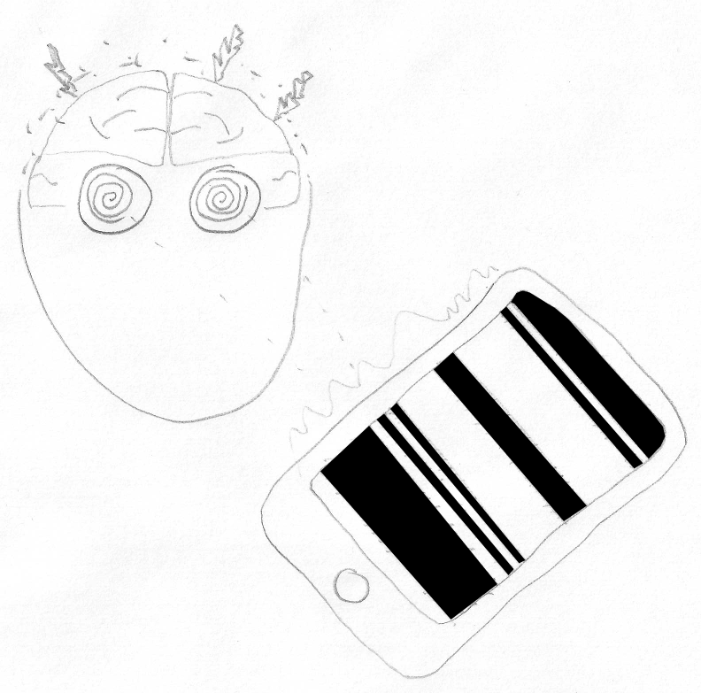
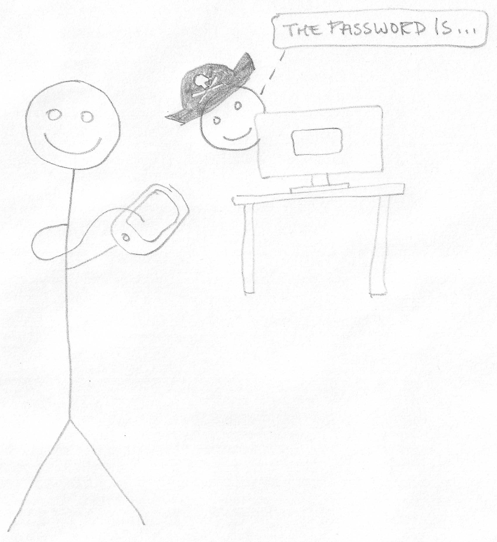
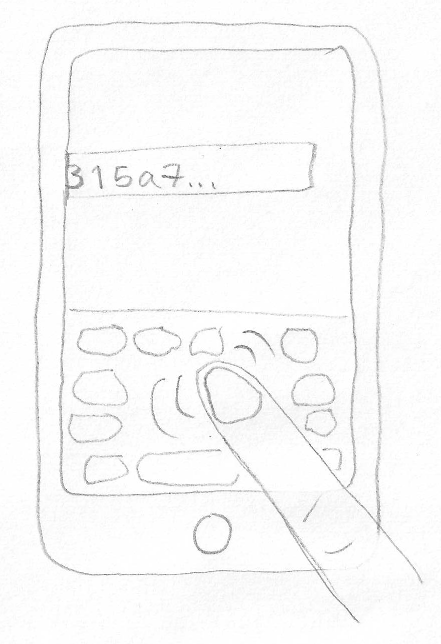
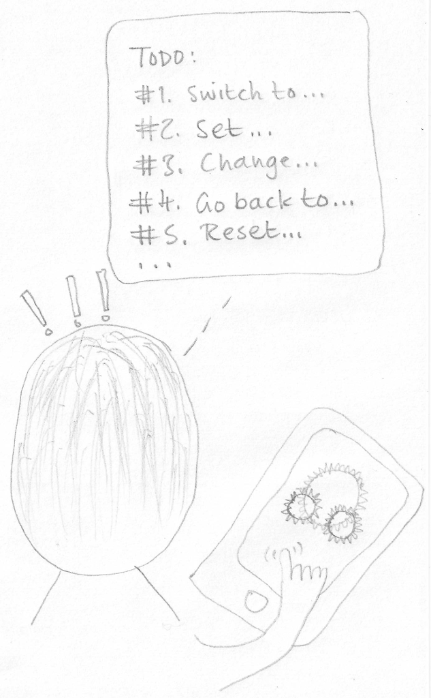

I have four horrible smartphone user interface experiences. I want a cartoon panel for each.

----

Brain pain
----------

The smartphone app generates a black and white pattern of bands that continuously expand, contract, merge and split apart in a wave like fashion.

Think of it as the visual equivalent of ringing a FAX machine!

The pattern causes the user to feel ill, possibly even have an epileptic fit.

Suggestion:

> Maybe show circular swirls in user's eyes, with transparent view of brain where some kind of electrical storm is occurring.
> 
> How to represent the ever shifting pattern of black and white bands seems hard to me.

----

Password piracy
---------------

A delighted user is happy at how easy his smartphone app is to use. At the same time a delighted hacker/pirate is happy at how easy it is to recover the user's password.

Suggestion:

> Maybe have the very happy user in the foreground with finger on smartphone.
> In the background a character in pirate cap is peaking out from behind a monitor - and a thought bubble coming from him with the text "The password is...".

----

Type type
---------

The user has to enter a very long alpha-numeric value (characters 0 to 9 and letters a to f) where they're bound to make a mistake.

Suggestion:

> Maybe just show a smartphone screen with keyboard and finger dithering over it looking for the next character, with the field for the value being so long that it doesn't all fit on the screen - some of it has already disappeared off to the left.

----

Too many steps
--------------

Normally apps guide you through any complex process step by step.

Imagine an app that tells you to do a madly complex set of steps, that you then have to do in your smartphone's settings area without any help from the app.

Suggestion:

> Maybe draw the picture as if we're looking at the user from behind, we see the back of their head, we see the smartphone screen showing the classic settings cog graphic and the user's finger hovering over the screen.
> And a thought bubble with a long list of actions:
> 
> TODO:
> #1. Switch to...
> #2. Set...
> #3. Change...
> #4. Go back to...
> #5. Reset...
> ...
> 
> And exclamation marks coming out of the user's head to show how confusing/complex this all is.

----

Reference section
-----------------

#### Settings cogs

----

#### Pirate hat

----

#### Brain

----

#### Swirl

----
