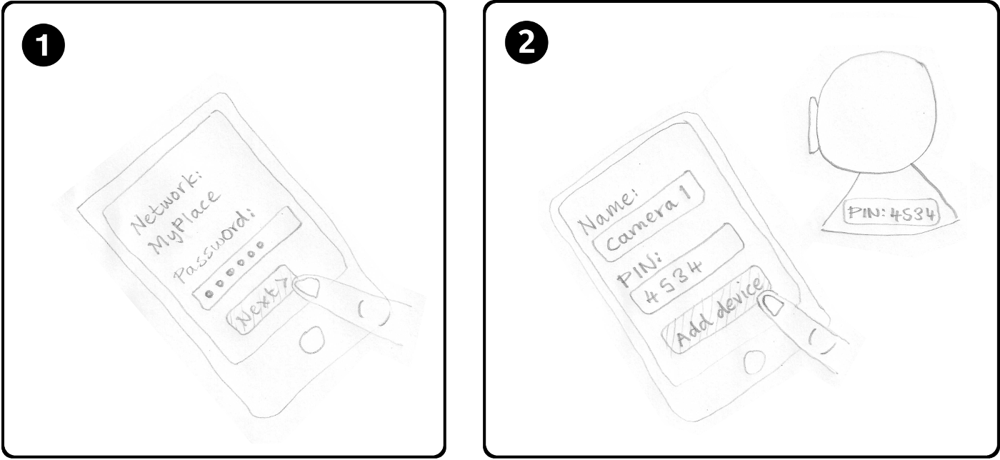
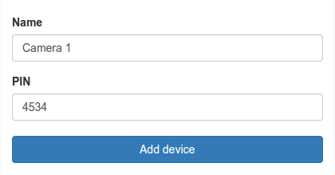

Easy setup
----------

This image shows two panels:

The first shows the user about to press the "Next >" button on a screeen that shows:

> Network:
> MyPlace
>
> Password:
> \*\*\*\*\*\*

Note: "MyPlace" isn't editable, so I haven't drawn a box around it.

The second image shows a baby monitor in the background with a sticker on it with the text "PIN: 4534".

In the foreground the user is about to press the "Add device" button on a screen that shows:

> Name:
> Camera 1
>
> PIN:
> 4534

----

Reference section
-----------------

#### Add device screen

