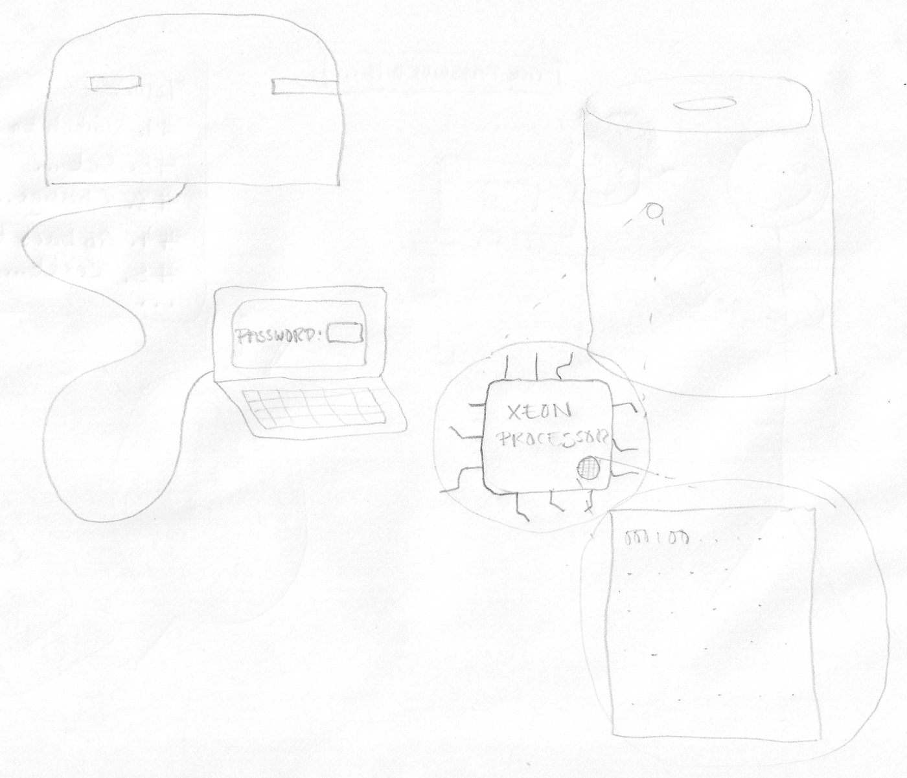

Password vs key
---------------



This image shows two situations:

1. The first situation - a laptop showing an empty text field with the text "Password:" to the left. The laptop is connected by a thin cable to a World War II style bunker. The bunker is supposed to represent "toughness" - it's not supposed to be something military so there shouldn't be any guns or anything poking out of it.
2. The second situation - a really powerful computer, like a MacPro, we zoom in on a bit of it and see one of the processors (kind of like the Wi-Fi chip you drew before). And then we zoom in on it again and see a document that's contains just binary code.

The processor has the words "Xeon&reg; Processor" on it (see the image of the processor below - don't draw the Intel logo, or any text other than "Xeon&reg; Processor").


Unlike the Wi-Fi chip, do _not_ draw any connectors (like the thing marked in red) - just draw the wires coming out of the chip.

I've included a picture below of what you see if you look below the metal case of the chip. So for the little x-ray circle on the processor (that is zoomed out to the document) maybe just draw a simple grid.

My drawing is roughly square - but I want a more rectangular layout with the bunker and laptop on the left and the rest of the right.

Here is an example of binary code, this is the kind of thing that should be on the document.

```
0000000: 1f8b 0800 5eb4 f054 0003 ac9a 097c 1445  ....^..T.....|.E
0000010: bec7 8b99 260c 710c c318 6180 21e9 4cba  ....&.q...a.!.L.
0000020: 3144 0993 1072 310e 9361 1232 1181 8453  1D...r1..a.2...S
0000030: 8890 8424 1208 0493 0051 c244 7771 9f4f  ...$.....Q.Dwq.O
0000040: 5d16 71d1 45c1 d5e5 f240 4474 05e4 f444  ].q.E....@Dt...D
0000050: 4141 0141 51f0 5883 17fa 545c 3c71 deaf  AA.AQ.X...T\<q..
0000060: babb baab 27f8 d17d 9f57 e15b 5dff baeb  ....'..}.W.[]...
0000070: 5f77 0dde 5c6f ae37 d3eb cdcc cbcc 29cc  _w..\o.7......).
0000080: f5c2 6467 1685 bc17 36c1 a1d9 c5de 60f6  ..dg....6.....`.
0000090: d098 f0e2 11bf 129f 992c e6c8 205e bebc  .........,.. ^..
00000a0: e06f 9497 a795 57f4 1f96 97cd 1cb5 2d33  .o....W.......-3
00000b0: 08d1 cbcc cef2 06f3 bcbf 5166 d6ff b18d  ..........Qf....
00000c0: f95c 9983 e7d7 d42e 8829 3753 6950 6661  .\.......)7SiPfa
00000d0: f6af a4cf 1c3a 247b 84b7 284b d355 7ef6  .....:${..(K.U~.
00000e0: ef2b 3773 486c b98a 9531 a371 6e1d 9a4e  .+7sHl...1.qn..N
00000f0: 52c5 e6da 5a91 7aa5 e50e 14eb 1a9b c49a  R...Z.z.........
0000100: da96 aafa 86e6 f8d4 f854 c5bf 46ac 6f16  .........T..F.o.
0000110: 9b5b aa9a 5a6a e19c 2bb6 ccac c5a7 bea5  .[..Zj..+.......
0000120: a96a 4e5d f315 6273 a3b8 7066 2df5 46b4  .jN]..bs..pf-.F.
0000130: bafa 865a 1a7d 4e63 4d7d 5d3d e223 32b2  ...Z.}NcM}]=.#2.
0000140: d1a3 8bcd 331b e737 d488 d5b5 6253 6df5  ....3..7....bSm.
0000150: fcfa 8696 8cf8 f854 5aca f486 c6eb aef4  .......TZ.......
0000160: d4cf ad6b f4c4 f37a 51d5 f6ff df1f 99fa  ...k...zQ.......
0000170: 98a3 7a81 369a 1b1b 6a07 35d7 b6cc 9f67  ..z.6...j.5....g
0000180: ea97 fcdf ee97 ecac acdc 60b1 a2e7 acfc  ..........`.....
0000190: 1139 bfaf fc2c 53bf 98ca 1f3c 616e 7dd6  .9...,S....<an}.
00001a0: a0e2 fad6 da9a cc9c 8c79 cd4a 3fe5 0856  .........y.J?..V
00001b0: 07fd 2638 1c8e 36e0 af22 9a69 570d 5c8f  ..&8..6..".iW.\.
00001c0: 4c30 ffd1 509b cdd6 0e48 bb16 db66 f387  L0..P....H...f..
00001d0: 4b4a c27e 7829 a6d0 9388 084a 14c5 f882  KJ.~x).....J....
00001e0: 2bd7 3df8 e0ba 9541 1f93 b7af 5bb7 fde1  +.=....A....[...
00001f0: 754c 4e4e 2b29 692f 8119 4388 dd8b f485  uLNN+)i/..C.....
```

Reference section
-----------------

#### Xeon processor


----

#### X-ray view of processor surface


----

#### Mac Pro


