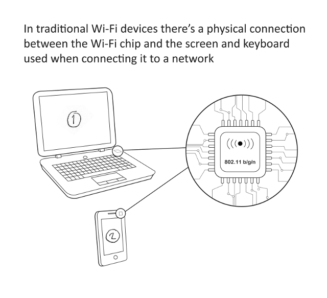
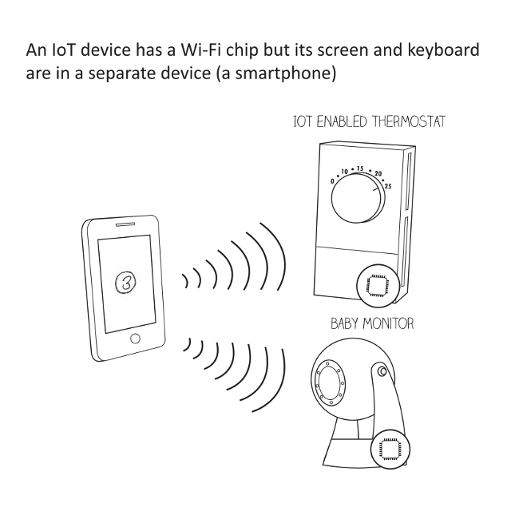
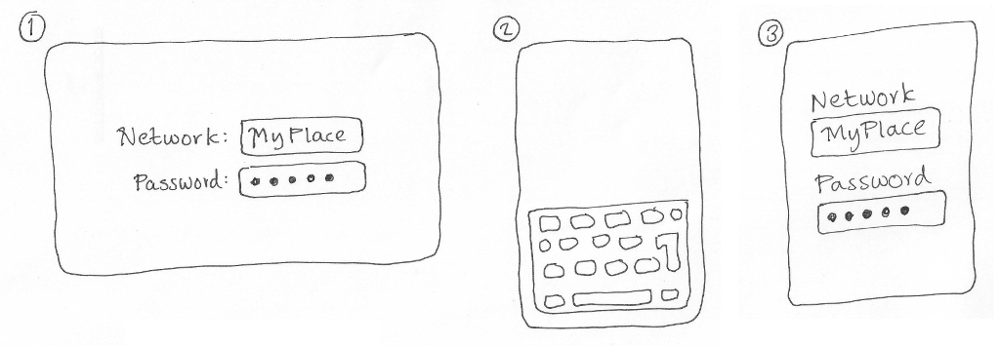

Modifications
-------------

Could you please modify these pictures you did last time to include the screen contents shown in my drawing below?







So in the first picture - on the laptop screen I want:

```
 Network: [ MyPlace ]
Password: [ ****** ]
```

And on the phone screen I just want to see the normal onscreen keyboard - it doesn't have to be very detailed, it just has to be clear that the keyboard is visible.

And in the second picture - on the phone screen I just want:

```
Network
[ MyPlace ]
Password
[ ****** ]
```
