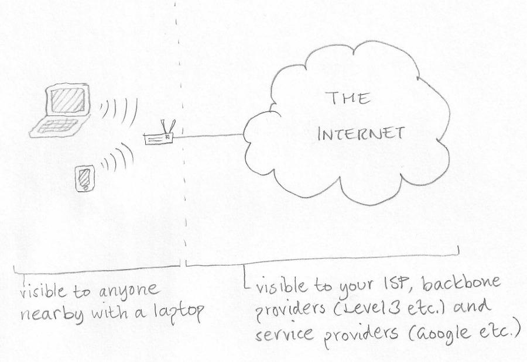
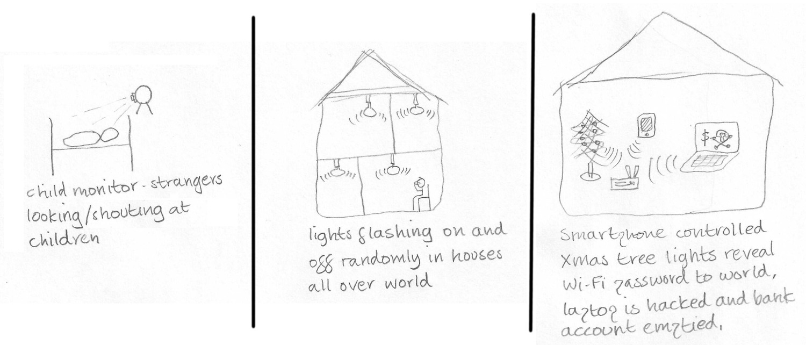
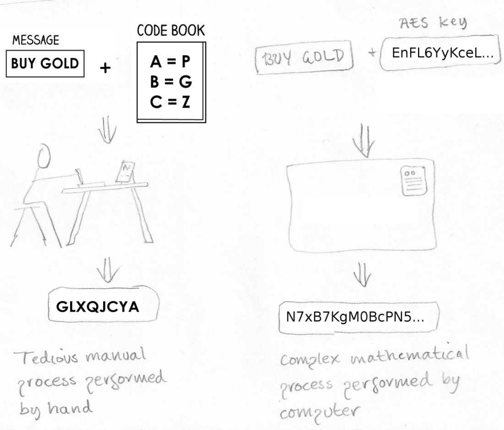
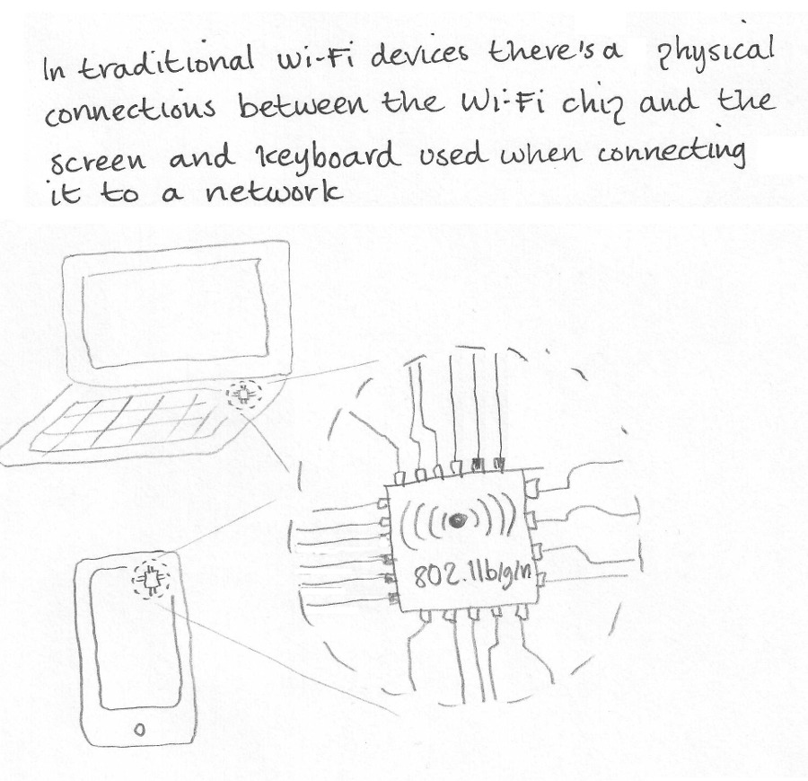
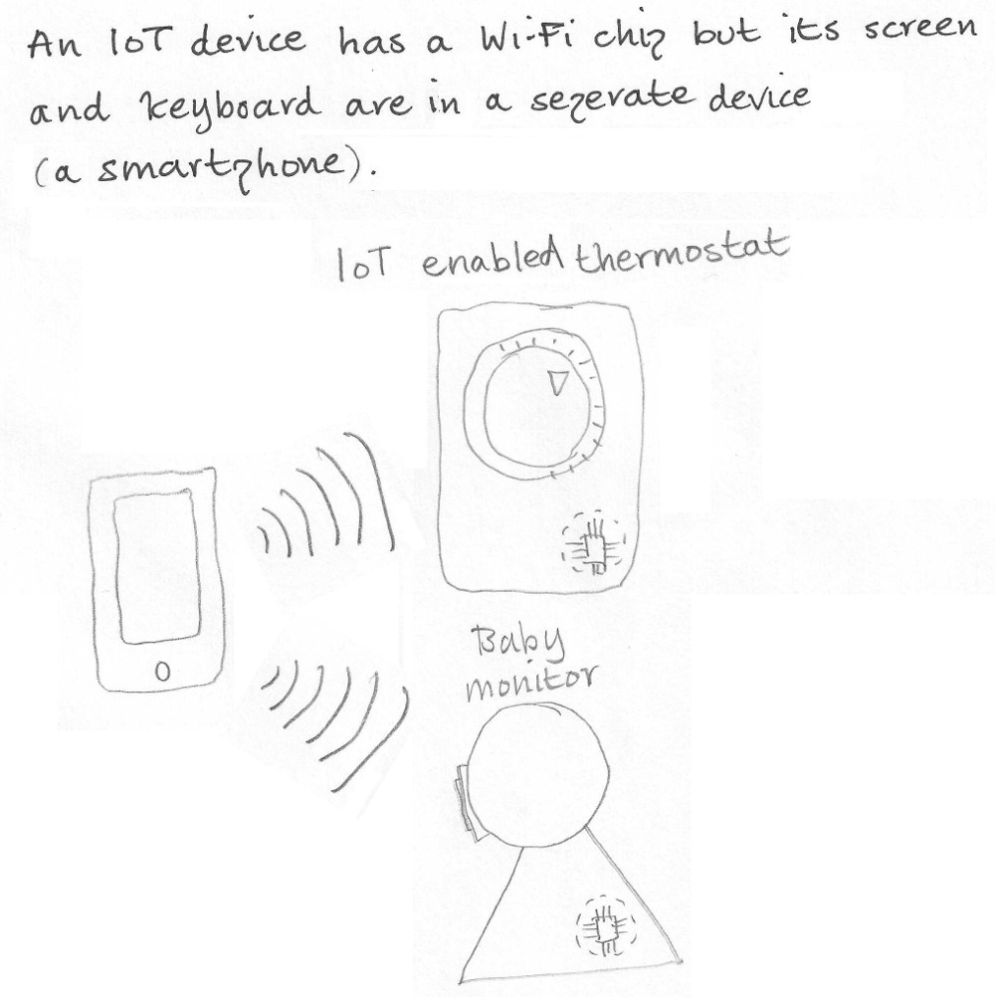
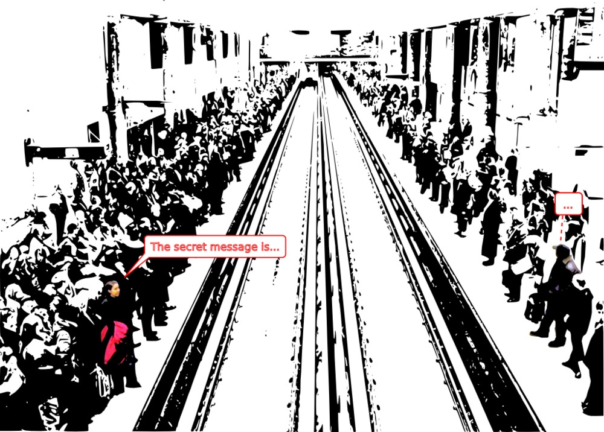
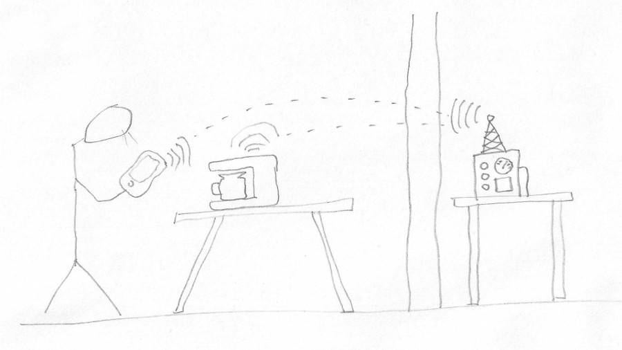
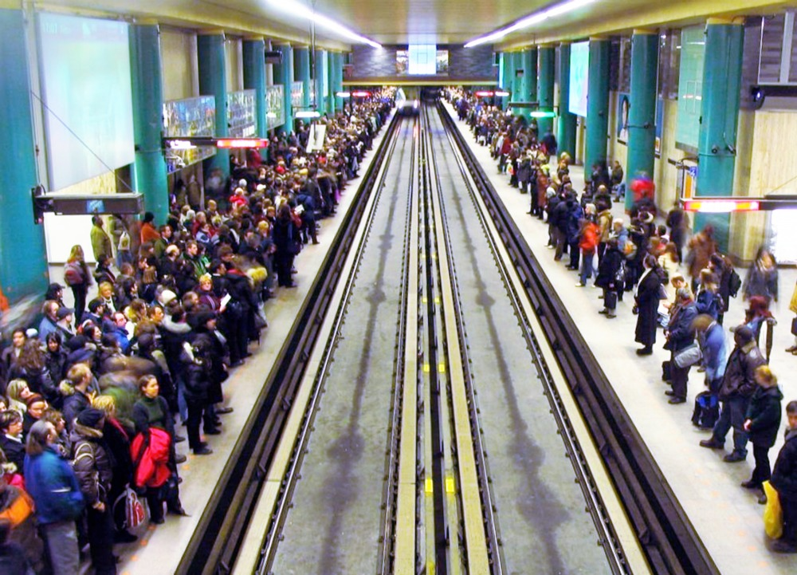

## 1. Visiblity

Shows a laptop and a smartphone communicating with a wireless router that's connected to the internet.

Text:

* visible to anyone nearby with a laptop
* visible to your ISP, backbone providers (Level 3 etc.) and service providers (Google etc.)

## 2. Dangers

Shows three situations:

* Baby in cot being watched by child monitor / webcam.
* A house where all the lights are flashing on and off wildly, and a person sitting with head in hands (driven mad by lights).
* Shows a Christmas tree with lights, a wireless router, a smartphone and a laptop.

The Christmas tree lights are high tech and (like the smartphone and laptop) are communicating with the wireless router.

On the laptop screen is a big $ (dollar) sign and a skull and cross bones.

Text:

* child monitor - strangers can look or shout at the child
* lights flashing on and off randomly in houses all over the world
* smartphone controlled Xmas tree lights reveal home Wi-Fi password to world, laptop is hacked and bank account emptied

Note: in nearly every picture here you see Wi-Fi "waves" - i.e. waves emanating from smartphones, laptops, high tech Christmas trees etc. In the middle frame above I've drawn _similar_ lines emanating from the light bulbs but this isn't Wi-Fi, it's to try and show that the lights are flashing on and off madly - if you've got a better idea for showing this then perfect.

Note: if you feel this picture is too much to do as a single image, then please split it into individual frames and charge for them separately. Or simply charge a different fee for pictures you think involve more work than normal. Whatever you think is fair and reasonable. The same goes for all the pictures here.

## 3. Encryption then and now

Shows:

* a man sitting at a table writing, looking at his code book to encrypt "buy gold".
* a supercomputer taking a modern AES key and encrypting the same message.

Text:

* Tedious manual process performed by hand
* AES key
* Complex mathematical process performed by computer

Please just draw the computer as a large blank cabinet with a small panel (consisting of some lights above a few air vents).

## 4. Traditional Wi-Fi

Shows:

* a laptop and a smartphone - with a dotted outline showing the Wi-Fi chip inside each of them.
* a zoomed in view of the Wi-Fi chip.

Text:
* In traditional Wi-Fi devices there's a physical connection between the Wi-Fi chip and the screen and keyboard used when connecting it to a network.
* 802.11b/g/n

## 5. IoT Wi-Fi

Shows:

* a smartphone communicating with a thermostat and a baby monitor.
* the thermostat and baby monitor have the same dotted outline showing the same as in the previous picture.

Text:

* An IoT device has a Wi-Fi chip but its screen and keyboard are in a separate device (a smartphone).
* IoT enabled thermostat
* baby monitor

## 6. Train station

Shows:

* a very crowded subway station
* two people on either side of the track, one shouting a message, one concentrating on the message.

Text:

* The secret message is...

Maybe add some color to emphasize the two people communicating among the crowd of other people.

## 7. Man-in-the-middle

Shows:

* User looking at smartphone, thinking he's directly controlling his fancy new Wi-Fi enabled coffee machine.
* High tech filter coffee machine.
* Spy equipment in another apartment in the same building, with a high power antennae.

The smartphone is really communicating with the spy equipment, which in turn is communicating with the coffee machine.

----
----

## Reference section

Here are just some photos I've found on the Web that are good representations of some of the items I've used in my pictures above.

#### Wireless router

#### Wi-Fi chip

#### Baby monitor

#### Christmas tree with lights

#### Skull and cross bones

#### Thermostat

#### Baby cot

#### Train station

#### Coffee machine

#### Spy equipment

#### High power antennae

